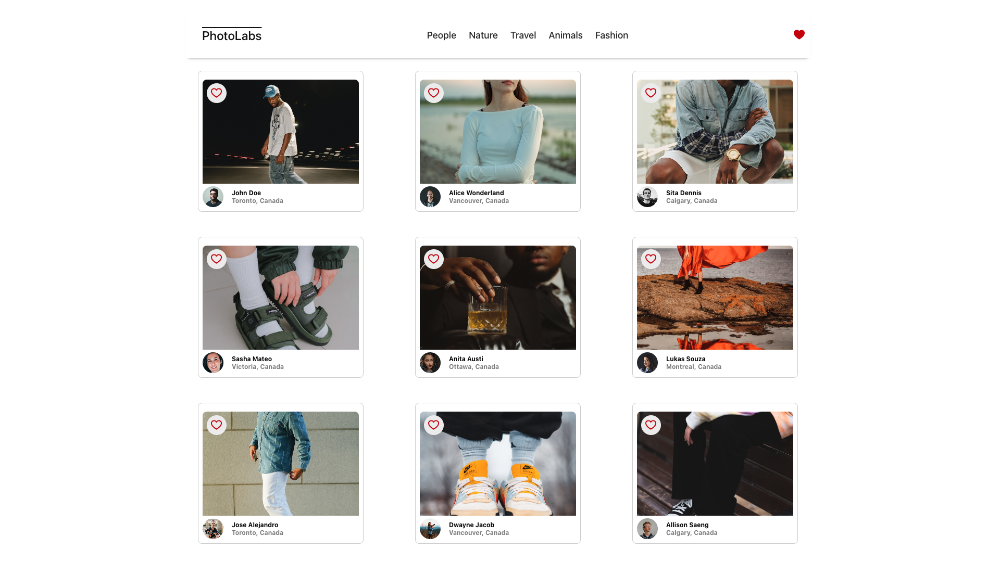
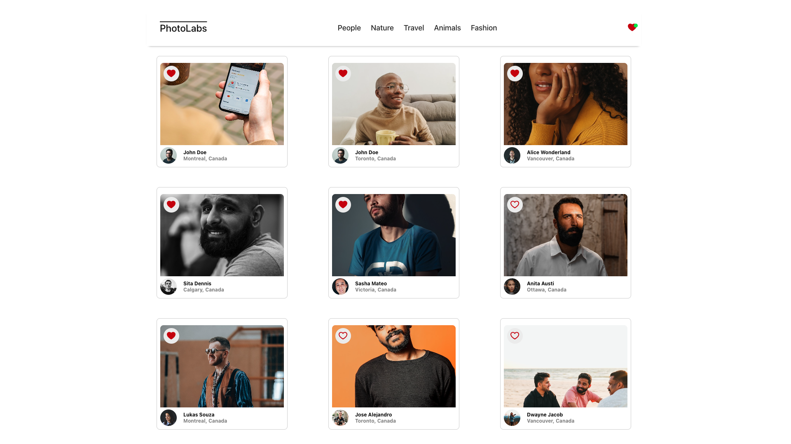
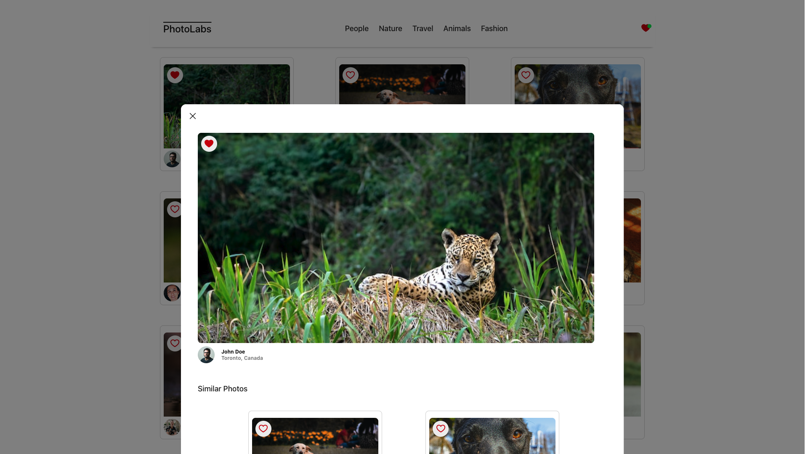
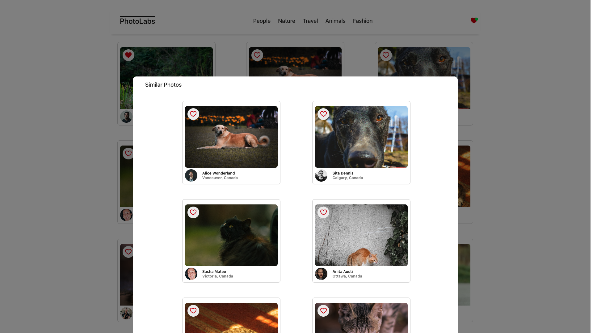

# Photolabs
PhotoLabs is a React-based single-page application (SPA) that allows users to view and favorite photos.

#### Default landing page.


#### Main viewer when photos are favorited.


#### Modal viewer when a photo is clicked.


#### Suggested similar photos in the modal viewer.


## Features
- View a collection of photos.
- Favorite photos.
- Organize photos by category.
- Detailed photo viewing modal.
- Similar photo suggestions in the modal.

## Tech Stack
### Frontend
- React.js
- Sass

### Backend
- Node.js
- PostgreSQL
- Express

## Setup
To run this project locally follow these steps:

1. Clone the repository:
```sh
git clone https://github.com/linkwithlionhart/photolabs-react
```

2. Navigate to the project directory:
```sh
cd your-repo-name
```

3. Install dependencies with `npm install` in each respective `/frontend` and `/backend`.
```sh
npm install
```

## [Frontend] Running Webpack Development Server
Read `frontend/readme` for further setup details.
```sh
cd frontend
npm start
```

## [Backend] Running Backend Server
Read `backend/readme` for further setup details.
```sh
cd backend
npm start
```
